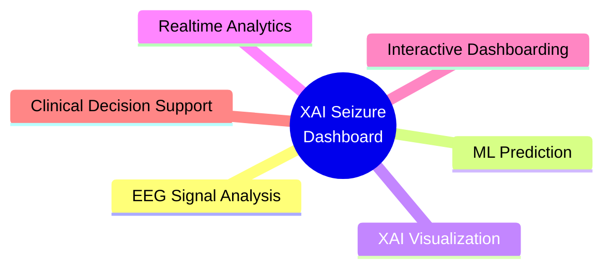
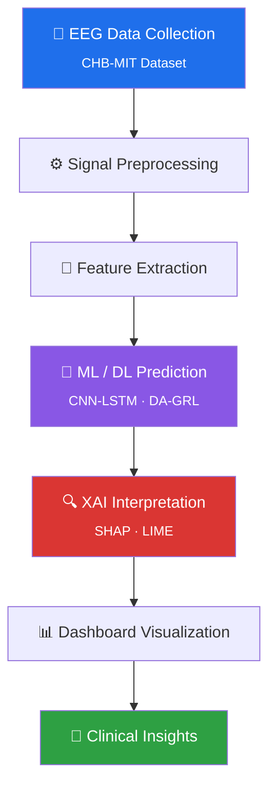

<div align="center">
  
# 🧠 XAI Seizure Prediction Dashboard
### Explainable AI for Epileptic Seizure Risk Prediction

*An advanced Explainable AI (XAI) powered seizure prediction and neurological monitoring dashboard built using Machine Learning, Deep Learning, and interactive medical analytics visualization.*


</div>

This project focuses on predicting epileptic seizure risks using EEG-based neurological datasets while providing transparent AI explanations for medical interpretability and clinical trust.

---

## 🗂️ Table of Contents

- [Project Overview](#-project-overview)
- [Core Features](#-core-features)
- [Tech Stack](#️-tech-stack)
- [AI Workflow](#-ai-workflow)
- [Project Structure](#-project-structure)
- [Installation](#️-installation)
- [Run Application](#️-run-application)
- [Dashboard Modules](#-dashboard-modules)
- [Security & Privacy](#-security--privacy)
- [Future Enhancements](#-future-enhancements)
- [Use Cases](#-use-cases)
- [Contribution](#-contribution)
- [Author](#-author)
- [License](#-license)

---

## 🚀 Project Overview

The XAI Seizure Prediction Dashboard is designed to assist:

| 🩺 | Audience |
|:---:|---|
| 🧑‍⚕️ | Neurologists |
| 🔬 | Healthcare researchers |
| 🏥 | Medical institutions |
| 🤖 | AI healthcare analysts |
| 🧠 | EEG research teams |

The platform combines:



---

## ✨ Core Features

<table>
<tr>
<td width="50%" valign="top">

### 🧠 Seizure Prediction Engine
- AI-powered seizure risk classification
- EEG signal pattern recognition
- Early seizure probability estimation
- Real-time prediction confidence scoring

</td>
<td width="50%" valign="top">

### 🔍 Explainable AI (XAI)
- SHAP visualizations
- Feature importance analysis
- Transparent prediction reasoning
- Model interpretability dashboard
- Clinical trust visualization

</td>
</tr>
<tr>
<td width="50%" valign="top">

### 📊 Interactive Analytics Dashboard
- Realtime charts
- EEG trend monitoring
- Neurological signal visualization
- Risk heatmaps
- Prediction timelines

</td>
<td width="50%" valign="top">

### 🏥 Patient Monitoring
- Patient profile management
- Historical seizure records
- Risk progression tracking
- Alert monitoring system

</td>
</tr>
<tr>
<td width="50%" valign="top">

### ⚡ AI Model Integration
- Machine Learning models
- Deep Learning architecture support
- Ensemble prediction systems
- Real-time inference pipeline

</td>
<td width="50%" valign="top">

### 📈 Medical Insights
- Seizure probability analysis
- EEG feature extraction
- Temporal signal analysis
- Statistical health reporting

</td>
</tr>
</table>

---

## 🛠️ Tech Stack

<div align="center">

### Frontend


### Backend


### AI / ML


### Database


### Visualization


</div>

---

## 🧪 AI Workflow



---

## 📂 Project Structure

```text
XAI-Seizure-predicion-dashboard/
│
├── 📁 frontend/                 # React frontend dashboard
├── 📁 backend/                  # API & ML backend
├── 📁 models/                   # Trained ML/DL models
├── 📁 datasets/                 # EEG datasets
├── 📁 analytics/                # XAI & statistical analysis
├── 📁 visualizations/           # Charts & reports
├── 📁 public/                   # Static assets
├── 📁 docs/                     # Documentation
└── 📄 README.md
```

---

## ⚙️ Installation

**1. Clone Repository**
```bash
git clone https://github.com/shadow-byte-warrior/XAI-Seizure-predicion-dashboard.git
```

**2. Navigate to Project**
```bash
cd XAI-Seizure-predicion-dashboard
```

**3. Install Frontend Dependencies**
```bash
npm install
```

**4. Install Backend Dependencies**
```bash
pip install -r requirements.txt
```

---

## ▶️ Run Application

<table>
<tr>
<td width="50%">

**Start Frontend**
```bash
npm run dev
```

</td>
<td width="50%">

**Start Backend**
```bash
python app.py
# OR
uvicorn main:app --reload
```

</td>
</tr>
</table>

---

## 📊 Dashboard Modules

| Module | Description |
|---|---|
| 🧠 **EEG Monitoring** | EEG waveform visualization · Brain signal tracking · Neurological activity analytics |
| ⚠️ **Seizure Risk Analysis** | Low / Medium / High risk scoring · AI confidence percentages · Early warning indicators |
| 🔍 **Explainability Panel** | SHAP value analysis · Feature contribution mapping · Prediction transparency |
| 📈 **Historical Trends** | Patient risk progression · Seizure occurrence analytics · Longitudinal health insights |

---

## 🔐 Security & Privacy

- 🏥 HIPAA-inspired architecture concepts
- 🔒 Secure API handling
- 🧍 Patient data isolation
- 🔑 Encrypted communications
- 🛡️ Role-based dashboard access

---

## 🧬 Future Enhancements

- [ ] Wearable IoT EEG integration
- [ ] Realtime hospital monitoring
- [ ] Mobile healthcare application
- [ ] AI anomaly detection
- [ ] Federated medical learning
- [ ] Doctor collaboration portal
- [ ] Cloud-native deployment

---

## 🌍 Use Cases

<div align="center">

| 🏥 Hospital Neurological Depts | 🧠 Epilepsy Monitoring Centers | 🔬 Medical AI Research |
|:---:|:---:|:---:|
| **📊 EEG Diagnostics** | **🩺 Clinical Decision Support** | **📈 Healthcare Analytics** |

</div>

---

## 🤝 Contribution

Contributions are welcome! 🎉

1. 🍴 Fork repository
2. 🌿 Create feature branch
3. 💾 Commit changes
4. 📤 Push branch
5. 🔁 Open Pull Request

---

## 👨‍💻 Author

<div align="center">

**Arun Pandian**
AI Engineer | ML Researcher | Full Stack Developer

[](https://github.com/shadow-byte-warrior)
[](https://linkedin.com/in/arunpandian-sh2030)

</div>

---

## 📜 License

This project is licensed under the **MIT License**.

---

<div align="center">

## ⭐ Project Vision

*To build an intelligent, explainable, and clinically assistive AI ecosystem capable of improving seizure prediction transparency and enhancing neurological healthcare decision-making through modern AI technologies.*

**If this project resonates with you, consider giving it a ⭐!**

</div>
